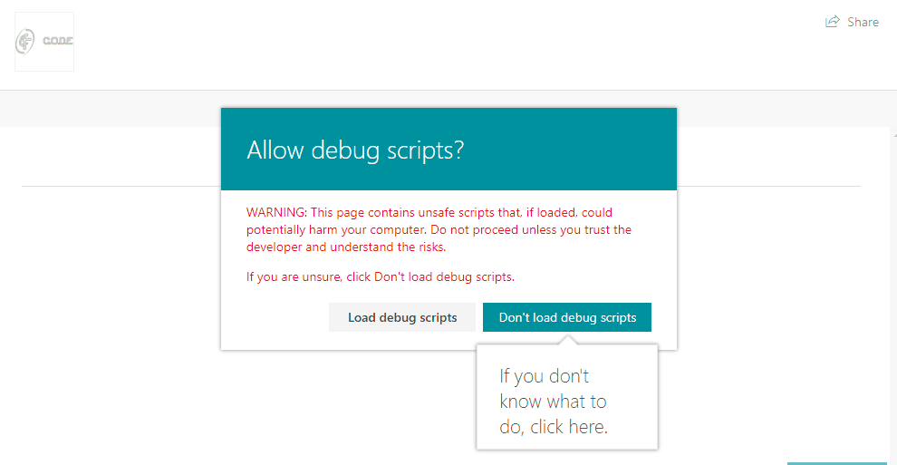

# spfx-IsExternallyShared
## SPFX Field Customiser
A SPFX Field Customiser to show if the item is externally shared 


//ToDo: Write how to deploy.

## PNP-Template
The pnp-FieldTemplate.xml is a PNP template you can use to add the field to your site.

Navigate the the PNP-Template folder, then using Powershell with PNP-PowerShell
```powershell
Connect-PnPOnline -Url:'https://<yourtenant>.sharepoint.com/sites/DeveloperSite'
``` 
Sign in with your credentials

```powershell
Apply-PnPProvisioningTemplate -Path:'.\pnp-FieldTemplate.xml' -Verbose
```

Once you have run the template, you can then add the column to any list manually. (I'll leave it to you to programmatically add it to your chosen lists)
